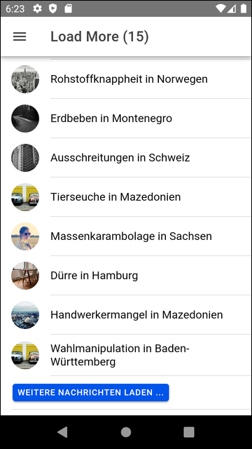

# Infinite Doom #

 

Die Ionic-App zeigt eine endlose Liste von zufällig erzeugten Negativschlagzeilen mit 
[Infinite Scrolling](https://ionicframework.com/docs/api/infinite-scroll) und einem 
"Load More"-Button am Ende der Liste als Alternative.

 

Der Name der App bezieht sich auf den Begriff [Doomscrolling](https://www.spiegel.de/psychologie/doomscrolling-wie-wir-trotz-schrecklicher-nachrichten-hoffnungsvoll-bleiben-podcast-a-75b371fa-ca64-407f-bb70-748f1123003e).

 

----

## Screenshots ##

 

 &nbsp; 

 

----

## License ##

 

See the [LICENSE file](LICENSE.md) for license rights and limitations (BSD 3-Clause License) for the files in this repository.

 
